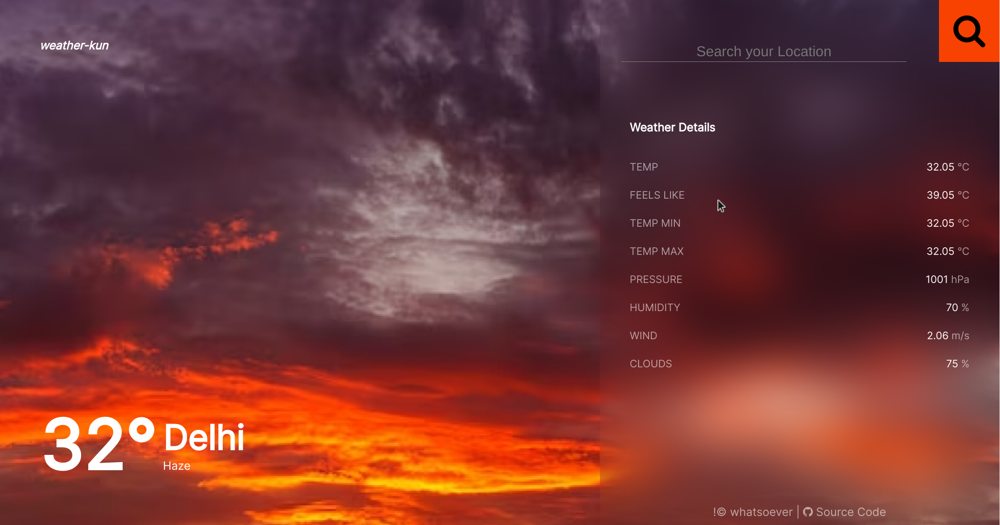

# weather-kun

Weather Kun is a web application that provides real-time weather information for any location. It is built using React, Node.js, and the OpenWeatherMap API.



## Features

- Get real-time weather information based on IP geolocation
- Search functionality to find weather data for specific locations
- Display temperature, humidity, wind speed, and weather conditions

## Technologies Used

- React
- Node.js
- Express
- OpenWeatherMap API

## Installation

1. Fork the repository by clicking the "Fork" button on the GitHub repository page.

2. Clone the forked repository to your local machine:

   ```bash
   git clone https://github.com/YourUsername/weather-kun.git
   ```

3. Create a `.env` file in the `server` directory with the following content:

   ```env
   API_KEY=your_openweathermap_api_key
   UNITS=metric
   DEFAULT_CITY=your_default_city
   CLIENT_URL=http://localhost:3000
   ```

   Replace `your_openweathermap_api_key` with your OpenWeatherMap API key, `metric` with your preferred unit of measurement (e.g., `standard`, `metric`, `imperial`), and `your_default_city` with the default city for weather information.

4. Create a `.env` file in the `client` directory with the following content:

   ```env
   REACT_APP_SERVER_URL=http://localhost:4000
   REACT_APP_GA_ID=your_google_analytics_id (optional)
   ```

   Replace `http://localhost:4000` with the URL of your server.

### Server

1. Navigate to the server directory:

   ```bash
   cd weather-kun/server
   ```

2. Install the dependencies:

   ```bash
   npm install
   ```

3. Start the server:

   ```bash
   npm start
   ```

   The server will start running on [http://localhost:4000](http://localhost:4000).

### Client

1. Navigate to the client directory:

   ```bash
   cd weather-kun/client
   ```

2. Install the dependencies:

   ```bash
   npm install
   ```

3. Start the development server:

   ```bash
   npm start
   ```

   The client application will open in your preferred web browser at [http://localhost:3000](http://localhost:3000).

## Usage

- The application development is complete. You can use the application to fetch real-time weather information for any location by IP geolocation or search for specific locations. The application will display temperature, humidity, wind speed, and weather conditions.

## Contributing

Contributions are welcome! If you have any ideas, suggestions, or bug reports, please open an issue on the GitHub repository. If you would like to contribute code, you can fork the repository, make your changes, and submit a pull request.

## License

This project is licensed under the [MIT License](LICENSE).
